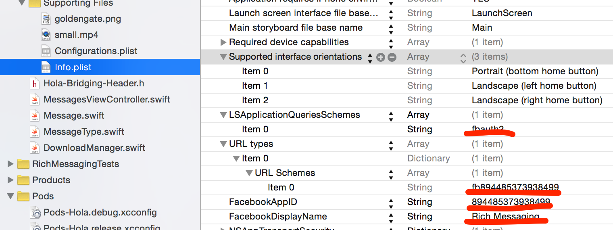

# Rich Messaging


We created a simple iOS chat app to demonstrate how rich content such as images, videos, and geographical location can be delivered and received using Magnet Message. Images and videos are uploaded to Amazon S3, and the URL to the file is delivered to the recipient. This app also demonstrates Facebook integration with Magnet Message.

## Features

* Login with Facebook
* Obtain a list of users to chat with
* One to one chat with a user
* Send and receive text, pictures, videos, or a map pointing out your current location
* Upload images and video (via Amazon S3) to be viewed by your recipient
* Obtain your current geographical location, and send the coordinates to your receipient to be viewed as a map

## Video Walkthrough


## Installation and customization

### Required
If you would like to try this sample out, you need to create your own Magnet Message app by following the instructions at [Creating Your First App](https://docs.magnet.com/message/v2/ios-swift-v2/creating-your-first-ios-app-user-to-user-chat-v2/). Once you obtain a `MagnetMax.plist` file, you can swap it with the one in the Rich Messaging app.

Since this app uses Facebook for iOS, you will need to follow the instructions on the [Facebook Developer Getting Started](https://developers.facebook.com/docs/ios/getting-started/) page to configure the Rich Messaging app to use your own Facebook developer account. In summary, you will need to create a Facebook app, import your own `facebook_app_id` into the Info.plist, and set up the Development Key Hash for your development machine at Facebook.


###Optional###
Sign up and update your [Amazon S3](https://aws.amazon.com/s3/) API keys in ````Constants.h````. **This is necessary for image and video uploads to work!**

## How To Use

1. From the Login screen, log in with Facebook (make sure you have added the Facebook user as tester in "Roles" tab of Facebook developer console).
2. From the User Select screen, select a user to chat with. You can select your own username to send messages to yourself.
3. Click "Message Screen" button on the right top corner
4. From the Rich Messaging screen, try sending all the different types of rich content.

## Android Version of the app is here:
https://github.com/magnetsystems/message-samples-android/tree/develop/RichMessaging
