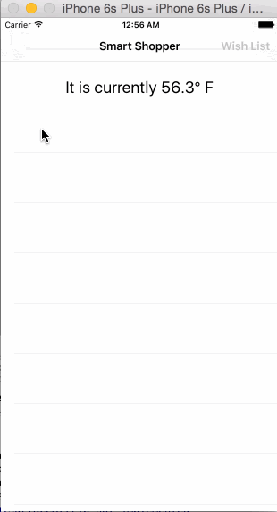

# Smart Shopper

Smart Shopper allows a user to search for contextually relevant products, share them with friends or add them to your Wish List. It uses the [Weather Underground APIs](http://theweatherapi.com/) to retrieve the current weather and searches for a relevant product using the [Walmart Labs APIs](http://github.com/walmartlabs/getting-started). It uses [Magnet Message](https://www.magnet.com/developer/magnet-message/) APIs to implement **Share a Product** and **Wish List** features.

**Note: ** Test API keys for Weather Underground, Walmart Labs and Magnet Message are included. But, it is strongly recommended to get your own API keys by following these links:
* [Magnet Message](https://docs.magnet.com/message/ios/creating-your-first-app-ios/)
* [Weather Underground](http://theweatherapi.com/)
* [Walmart Labs](http://github.com/walmartlabs/getting-started)

## Magnet Message Sample code

* Register/Login
* Send Message
* Find Channel by name
* Publish to a Channel
* Discover Users

## Other sample code
* Retrieve weather using [Weather Underground APIs](http://theweatherapi.com/)
* Search for a product using [Walmart Labs APIs](http://github.com/walmartlabs/getting-started)
* Asynchronous image loading and caching

## Video Walkthrough

## Android Version of the app is here : https://github.com/magnetsystems/message-samples-android/tree/develop/SmartShopper
